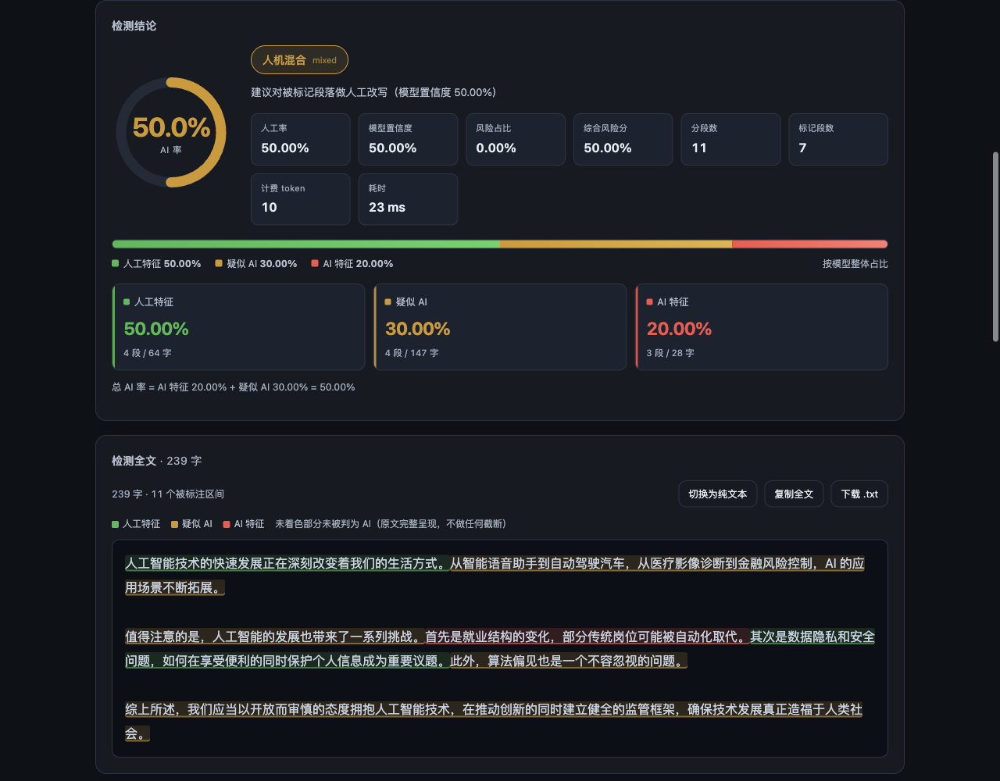

# zhuque-detect · 让 Agent 自动优化 AI 率

**通过 MCP 连接 Codex、WorkBuddy 等 Agent，把“检测 → 定位 → 改写 → 复检”交给 Agent 连续完成。**

本项目基于**腾讯朱雀 AI 文本检测**（EdgeOne Makers 的 `@makers/zhuque-text`）。朱雀提供检测结果；你所连接的 Agent 负责理解原文、改写被标记段落，并再次调用检测工具。所有工具共用同一套核心，支持 macOS 和 Windows，零第三方运行时依赖。

[网站与接入教程](https://takimotouki.github.io/zhuque-detect/) · [下载两个平台版本](https://github.com/TakimotoUki/zhuque-detect/releases/latest) · [创建 API Key](https://console.cloud.tencent.com/edgeone/makers?tab=models&subTab=apikey) · [腾讯官方 API 文档](https://cloud.tencent.com/document/product/1552/137539)

## 本机网页检测

下载并启动后，打开本机网页即可粘贴文章、一键检测。结果显示总 AI 率、人工特征 / 疑似 AI / AI 特征占比，以及完整原文的段落高亮；可按类别筛选、复制和下载正文。网页还提供历史筛选与 JSON / CSV 导出、token 用量统计和校准、API Key / 多账号池管理。网页与 MCP 共用结果和历史，便于自己查看与 Agent 迭代。



*真实程序界面截图，使用本机假上游和合成 Key 演示。示例分数与用量仅展示功能。项目官网是介绍与教程；实际检测在下载后启动的本机网页中进行。*

## 为什么用 API + MCP

在朱雀官网反复粘贴文本、检测、复制结果，再把结果交给 Agent，操作容易中断。MCP 让 Agent 直接拿到总 AI 率、三项占比和逐段位置，按原文语境修改后自行复检，历史记录也能用于比较每一轮结果。

| | 朱雀官网在线体验 | 本项目 API + MCP |
|---|---|---|
| 接入 | 浏览器中手动操作 | Codex / WorkBuddy 原生工具调用 |
| 用量 | 未登录 5 次/日；登录后 20 次/日（用户实测）；活动可能改变规则 | 当前官方文档：每账号每月免费额度 50 万 token |
| 迭代 | 手动复制检测结果、改写、再次粘贴 | Agent 在约定轮数内自动检测、定位、改写、复检 |
| 多账号 | 在官网管理各自登录状态 | 添加不同账号的 API Key，以账号池轮询和故障转移 |
| 结果 | 官网展示 | 网页、MCP、HTTP、CLI 共用结构化结果与本地历史 |

额度说明核对于 **2026-10-07**，登录后 20 次由用户于 **2026-10-08** 实测：[朱雀 API 文档](https://cloud.tencent.com/document/product/1552/137539)规定每月 50 万 token；[EdgeOne 官方说明](https://pages.edgeone.ai/zh/use-cases/free-llm-api)指出免费额度在同账号项目间共享。**同一个账号的多把 Key 不会叠加免费额度**，也不能把 50 万 token 等同于固定次数或固定字数。真实扣减以响应中的 `makers_models_usage.total_tokens` 和控制台为准。当前免费计划、限流与周期可能调整，应以控制台当期规则为准。

## 三步接入

### 1. 下载、配置 Key

安装受支持的 **Node.js 22 或更高版本**，推荐当前 LTS：[Node.js 下载](https://nodejs.org/)。解压 [macOS / Windows 发布包](https://github.com/TakimotoUki/zhuque-detect/releases/latest)，双击 `启动服务.command` 或 `启动服务.cmd` 打开本机网页。

点击 [**EdgeOne 控制台 → Makers → Models → API Key**](https://console.cloud.tencent.com/edgeone/makers?tab=models&subTab=apikey)，创建 API Key，回到本机网页“设置”填写并保存。发布包不预置 Key，不包含 `token.txt`。

也可把 Key 放在 `ZHUQUE_API_KEY` 环境变量或复制 `.env.example` 为 `.env` 后填写。配置优先级为：调用参数 / 请求头 → 环境变量 → 本机 `token.txt` → `.env` → Key 池 → 单 Key 配置。使用账号池时，应清除优先级更高的单 Key 来源。

### 2. 连接 Codex 或 WorkBuddy

**Codex：**进入解压目录运行：

```sh
node src/cli.mjs install-mcp --target codex
```

它会打印适合本机路径的注册命令与 TOML 配置。复制命令执行即可，基本形式如下（把路径改成你的真实绝对路径）：

```sh
codex mcp add zhuque-detect -- node "/绝对路径/zhuque-detect/src/mcp-server.mjs"
codex mcp list
```

Windows 同样用 `node` 和原生绝对路径，含空格时保留引号：

```powershell
codex mcp add zhuque-detect -- node "D:\My Tools\zhuque-detect\src\mcp-server.mjs"
```

**WorkBuddy：**运行 `node src/cli.mjs install-mcp --target workbuddy --write`，备份并合并到 `~/.workbuddy/mcp.json`，然后在客户端信任该服务并重启连接。

MCP 由客户端启动，不需要先开 HTTP 网页服务。换电脑或移动目录后重新生成注册命令；不用复制旧电脑的 Node 可执行文件路径。更多客户端与排查方式见 [MCP 接入指南](docs/MCP.md)。

### 3. 把迭代任务交给 Agent

复制下面的指令到已连接 MCP 的 Codex / WorkBuddy：

> 请通过 zhuque-detect MCP 优化这篇文章的 AI 率。先使用 detect_ai_text，is_merge=false，记录总 AI 率与历史 id；按 segments 中“AI 特征 / 疑似 AI”的原文位置有针对性地改写。保持论点、事实、引文、术语和原有文体，不编造资料或经历。每轮改写后再次检测并与历史比较；最多 3 轮，目标 AI 率低于 20%。若没有改善或影响文章质量，保留较好的版本并停止。最后给我正文与各轮检测记录。

目标值和轮数由你决定。检测工具提供信号，Agent 执行改写；结果可能波动，达不到目标时会保留记录，不能保证每篇文章下降到指定百分比。

## 账号池与用量

在“设置 → Key 池”中添加多个账号的 API Key，为同账号的 Key 填相同“所属账号”标识。池轮询可用 Key；401/403 自动停用该 Key；429 进入冷却，同账号标识下的 Key 一起冷却；接续尝试其他可用账号。长文只重试失败的分块，避免重复发送已成功分块。

本地用量账本记录本程序实际调用的 token，**不是云端余额查询接口**。来自其他程序的消费不会自动同步；可在网页用控制台读数校准。账期起点需按账号控制台设置；混用多个账号时，本地总账不等于某个账号余额，逐 Key 计数只用于本工具内的调用记录。

## 工具和其他入口

| MCP 工具 | 用途 |
|---|---|
| `detect_ai_text` | 单篇检测，返回 AI 率、分类占比、段落文本及位置 |
| `detect_ai_text_batch` | 最多 50 条批量检测，逐条返回成功或错误 |
| `get_detection_history` | 查询、筛选、读取历史，比较优化前后 |
| `get_zhuque_usage` | 本地 token 统计及 Key 池状态 |
| `get_zhuque_service_info` | 接口字段、配置状态和调用方信息 |

```sh
node src/cli.mjs detect --file draft.md --json
node src/cli.mjs detect --stdin --is-merge false --no-history
node src/cli.mjs serve --open
node src/cli.mjs schema
```

HTTP 示例：

```sh
curl -X POST http://127.0.0.1:8787/api/detect \
  -H 'Content-Type: application/json' \
  -d '{"text":"待检测文本","is_merge":false}'
```

[完整 API 和字段说明](docs/API.md) · [macOS 指南](scripts/mac/README-Mac.md) · [Windows 指南](scripts/win/README-Windows.md)

## 安全、隐私和边界

- 检测原文会发送到你配置的腾讯朱雀接口；本项目没有遥测或额外上传目的地。腾讯服务的数据处理规则适用于此调用。
- Key 和历史保存在本机 `~/.zhuque/`。macOS / Unix 文件使用 `0600`；Windows 使用用户目录权限，POSIX 模式不等于 Windows ACL。
- HTTP 默认只监听回环地址；非回环监听必须有服务访问令牌。浏览器来源和 Host 检查、缓存隔离、禁跟随上游重定向、响应大小与超时限制均已设置。
- 默认完整保存本地历史，可用 `--no-history` 或 `history:false` 禁用，也可用 `ZHUQUE_HISTORY_TEXT_MAX` 限制正文保存。配置备份最多保留 5 份；清除当前 Key 后备份仍可能含旧 Key。
- 默认 MCP 客户端名允许 `codex`、`workbuddy`，可添加其他客户端。客户端名可被模拟，这属于兼容性限制，安全边界是有权启动进程的本机用户。
- 当前只支持文本。短文本、特殊文体与长文分块会影响模型表现；检测分数不能直接证明作者身份。该仓库独立开发，腾讯朱雀提供检测能力。

[安全策略](SECURITY.md) · [审查记录与验证边界](docs/AUDIT.md)

## 开发、验证与打包

```sh
node src/selftest.mjs
node tests/security.test.mjs
node tests/site.test.mjs
node tests/platform.test.mjs
node src/webcheck.mjs
node scripts/check-release.mjs
node scripts/pack.mjs
```

打包器仅复制白名单中的运行文件，输出到新的 `dist/zhuque-detect-mac/` 与 `dist/zhuque-detect-win/`。禁止嵌入凭据，也不会清空已有非空输出目录。源码树不提交构建包、检测历史、日志、机器配置或含真实 Key 的文件；压缩下载包由发布流程生成。

## 贡献者与许可

- [TakimotoUki](https://github.com/TakimotoUki)：项目发起、需求定义、体验与发布方向。
- **Codex**：代码实现、审查修复、回归验证、文档与网站设计。

[MIT License](LICENSE) · [贡献指南](CONTRIBUTING.md) · [更新记录](CHANGELOG.md)
